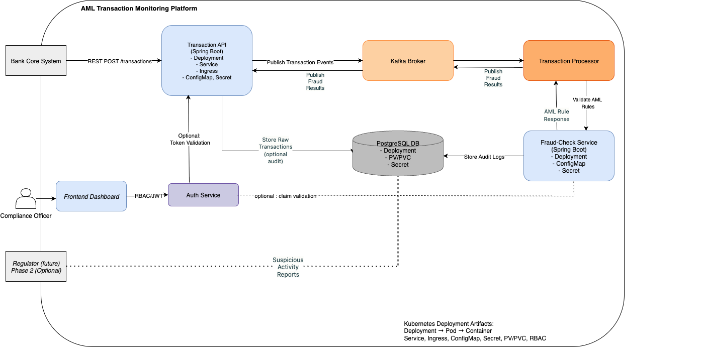

# AML Transaction Monitoring Platform — RegTech PoC 🚦🔍

This is a **Proof of Concept (PoC)** for an **AML (Anti-Money Laundering) Transaction Monitoring Platform**, built to demonstrate:

- 🏦 **Real-time transaction monitoring:** How a cloud-native system ingests transactions, processes them through a fraud-checking pipeline, flags suspicious activity, and logs results for audits.
- ☁️ **Core Kubernetes practices:** Shows Deployments, Pods, Services, Ingress, RBAC, Secrets, Storage, and Troubleshooting — doubling as my **CKA exam prep**.
- 🏆 **Solution Architect design skills:** A real, modular microservices system — not just isolated YAMLs — that proves my ability to design, deploy, and secure scalable compliance systems.

---

## 📌 **Why This Project Exists**

✅ Bridge my 11+ years banking domain experience with hands-on RegTech/Compliance pipelines.

✅ Use every YAML as **live CKA practice**:
- Core Concepts
- Scheduling & Affinity
- RBAC & Security
- Networking (Ingress, Services)
- Storage (PV/PVC)
- Troubleshooting

---

## ⚙️ **System Context**

### 👥 **Actors**

- **Bank Core System:** Sends raw transaction data.
- **Compliance Officer/Auditor:** Reviews flagged transactions via Frontend Dashboard.
- **Regulator (future scope):** Receives suspicious activity reports if required.

### 🧩 **Core Components**

| Component               | What it does                                                       |
|-------------------------|--------------------------------------------------------------------|
| `Transaction API`       | Spring Boot REST service to ingest transactions, publish to Kafka. |
| `Kafka Broker`          | Streams transactions in real time.                                 |
| `Transaction Processor` | Kafka consumer, prepares transactions for fraud checks.            |
| `Fraud-Check Service`   | Applies simple AML business rules, flags suspicious activity.      |
| `PostgreSQL DB`         | Stores transactions + audit logs securely.                         |
| `Auth Service`          | Manages RBAC/JWT roles for secure access.                          |
| `Frontend Dashboard`    | Allows Compliance Officer to review flagged transactions.          |

---

## 📐 **Architecture Diagram**




> **System Flows:**
> - Bank System → Transaction API → Kafka → Processor → Fraud-Check → PostgresSQL DB.
> - Compliance Officer → Frontend Dashboard → Auth Service.
> - Optional: Suspicious Activity Reports to Regulator.

---

## 📦 **Kubernetes Resources**

Every container here is deployed as:
- ✅ **Deployment → Pod → Container**
- ✅ **Service:** ClusterIP for internal, NodePort or Ingress for external APIs.
- ✅ **Ingress Resource:** Routes traffic securely to the Transaction API or Dashboard.
- ✅ **ConfigMaps & Secrets:** Store fraud rule thresholds, DB creds, JWT signing keys.
- ✅ **PV/PVC:** For PostgresSQL persistent storage.
- ✅ **RBAC:** Roles, RoleBindings, ServiceAccounts to manage access for `fraud-check-service` and other services.
- ✅ **NodeSelector, Taints/Tolerations:** Used to test Scheduling concepts for CKA.

---

## 📂 **Repo Structure**

```plaintext
poc-aml-monitoring/
 ├── docs/
 │   ├── architecture-diagram.drawio
 │   ├── architecture-diagram.png
 ├── k8s-yamls/
 │   ├── transaction-api/
 │   │   ├── deployment.yaml
 │   │   ├── service.yaml
 │   │   ├── ingress.yaml
 │   │   ├── configmap.yaml
 │   ├── fraud-check-service/
 │   │   ├── deployment.yaml
 │   │   ├── configmap.yaml
 │   │   ├── secret.yaml
 │   ├── postgres-db/
 │   │   ├── pv.yaml
 │   │   ├── pvc.yaml
 │   │   ├── deployment.yaml
 │   ├── rbac/
 │   │   ├── role.yaml
 │   │   ├── rolebinding.yaml
 │   │   ├── serviceaccount.yaml
 ├── transaction-api/
 │   ├── src/main/java/...  (Spring Boot code)
 ├── README.md

✅ `transaction-api` deployed with Deployment, Service, Ingress, ConfigMap, and Secret — practicing CKA Core Concepts + Security.
✅ transaction-api REST API live on Kubernetes — Dockerized, deployed with ConfigMap & Secret.
✅ fraud-check-service wired with REST, ConfigMap, Secrets — practicing Scheduling & RBAC.
